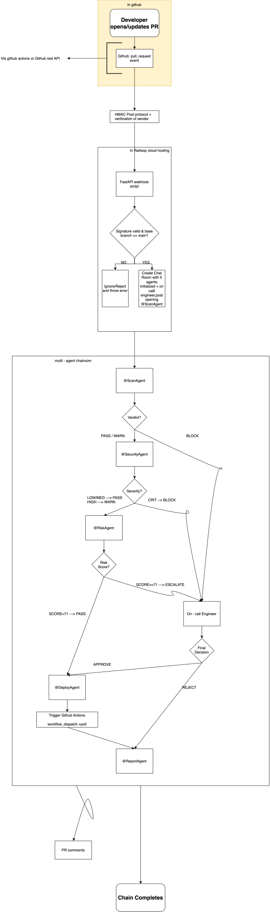

# Architecture

## System Architecture


## Architecture Overview

The system is designed as a **sequential, gated multi-agent deployment pipeline**. A GitHub Pull Request targeting `main` initiates the workflow, after which the backend constructs the relevant PR context and coordinates the agent approval sequence.

Each agent performs a specialized verification task and communicates the result to the next agent through **Band @mentions**. An agent cannot proceed unless the preceding stage has approved the deployment.

The pipeline consists of:

1. **GitHub PR Trigger** — Detects newly opened or updated pull requests targeting `main`.
2. **Backend Orchestrator** — Receives the webhook, builds the PR context, coordinates the workflow, and tracks execution state.
3. **Sequential Agent Chain**

   * Code analysis and security validation
   * Testing and regression analysis
   * Risk and impact assessment
   * Compliance and policy validation
   * Final deployment authorization
4. **Human Escalation** — Rejections or uncertain decisions can be routed to a human reviewer through Band.
5. **Deployment Trigger** — A fully approved workflow can trigger the actual GitHub Actions deployment.
6. **Notifications and Auditability** — Decisions, results, and workflow updates are recorded through the communication and logging infrastructure.

## Core Design Principle

The most important architectural property is that **deployment is gated by the complete approval chain**.

The final deployment agent is not merely instructed to wait for previous agents; the workflow itself controls progression through the approval sequence. Consequently, bypassing the communication and approval mechanism should prevent the deployment stage from receiving a valid authorization.

## Infrastructure

The system is designed around containerized services with separate components for orchestration, persistent state, and asynchronous coordination.

* **Docker** — Containerized application services
* **Railway** — Application deployment infrastructure
* **PostgreSQL** — Persistent state, workflow records, and audit information
* **Redis** — Queuing and transient coordination
* **GitHub Actions** — Deployment execution

## LLM Abstraction

LLM access is isolated behind a provider-agnostic interface. This allows individual agents to use different models while keeping the agent implementation independent of the underlying inference provider.

The architecture supports multiple OpenAI-compatible providers, with **Featherless** as the primary provider and **AI/ML API** as a secondary provider.

## Communication Model

Band acts as the communication layer between agents. Instead of relying solely on direct function calls between agents, the approval chain is represented through explicit `@mentions` and recorded agent interactions.

This provides:

* Explicit agent-to-agent communication
* Visible approval history
* Traceable decisions
* A persistent audit trail
* Human intervention when required

## Approval Flow

```text
GitHub PR
    │
    ▼
Backend Orchestrator
    │
    ▼
CodeSentinel
    │ APPROVE
    ▼
TestPilot
    │ APPROVE
    ▼
RiskAnalyzer
    │ APPROVE
    ▼
ComplianceGuard
    │ APPROVE
    ▼
DeployAgent
    │
    ▼
GitHub Actions
    │
    ▼
Deployment
```

A rejection at any stage terminates or escalates the normal approval path rather than allowing the workflow to proceed directly to deployment.

## Design Goals

The architecture prioritizes:

* **Sequential gating** — downstream agents cannot execute before required approvals.
* **Safety** — deployment requires explicit authorization from the complete chain.
* **Observability** — agent decisions and workflow state remain traceable.
* **Auditability** — approval history and execution results can be reconstructed.
* **Human-in-the-loop operation** — automation can escalate decisions rather than blindly proceeding.
* **Provider independence** — LLM providers can be changed without redesigning the agents.
* **Deployment integration** — the safety system ultimately controls a real deployment workflow rather than functioning only as a simulation.
